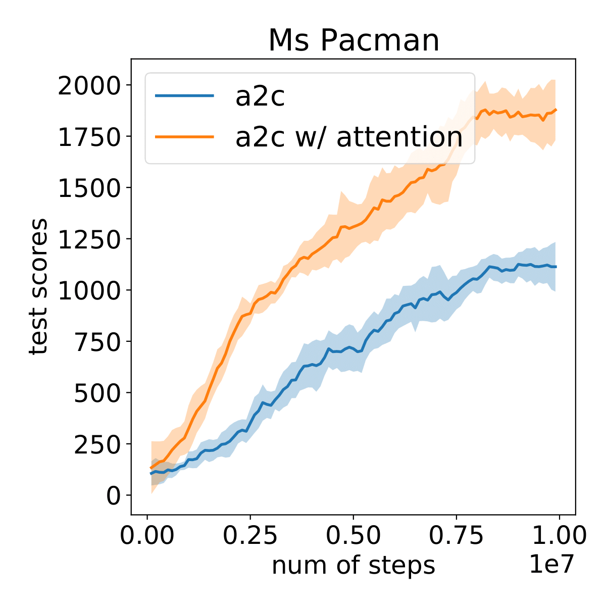

# Self-Supervised Attention-Aware Reinforcement Learning  

This is a PyTorch implementation of [Self-Supervised Attention-Aware Reinforcement Learning](https://ojs.aaai.org/index.php/AAAI/article/view/17235) (AAAI-2021)

If you find this repository useful in your research, please cite

    @article{Wu_Khetarpal_Precup_2021, 
    title={Self-Supervised Attention-Aware Reinforcement Learning}, 
    author={Wu, Haiping and Khetarpal, Khimya and Precup, Doina}, 
    journal={AAAI}, 
    year={2021}, 
    }

## Requirements

* Python 3 
* [PyTorch and TorchVision](http://pytorch.org/) (Tested under torch==1.3.0, torchvision==0.4.1)
* [OpenAI baselines](https://github.com/openai/baselines)

In order to install requirements, follow:

```bash
# PyTorch
conda install pytorch torchvision -c soumith

# Other requirements
pip install -r requirements.txt

# Baselines for Atari preprocessing
git clone https://github.com/openai/baselines.git
cd baselines
pip install -e .
pip install gym[atari] 
```


## Training

Train single-task A2C agent with self-supervised attention module.


### Train with default config
The default config experiments/atari/a2c_mspacman_selfatt_thre1e-2_clsag1e-3.yaml 
provides the training config for env MsPacmanNoFrameSkip-v4, with hyper-parameters: sparsity penalty=1e-3, reconstruction threshold=1e-2.
```bash
# change to your config file
config=experiments/atari/a2c_mspacman_selfatt_thre1e-2_sparsity1e-3.yaml
python main.py --cfg $config
```

## Results 




## Acknowledgements

The repo is based on [pytorch-a2c-ppo-acktr](https://github.com/ikostrikov/pytorch-a2c-ppo-acktr-gail).
Thank you all for the great open source repositories!
